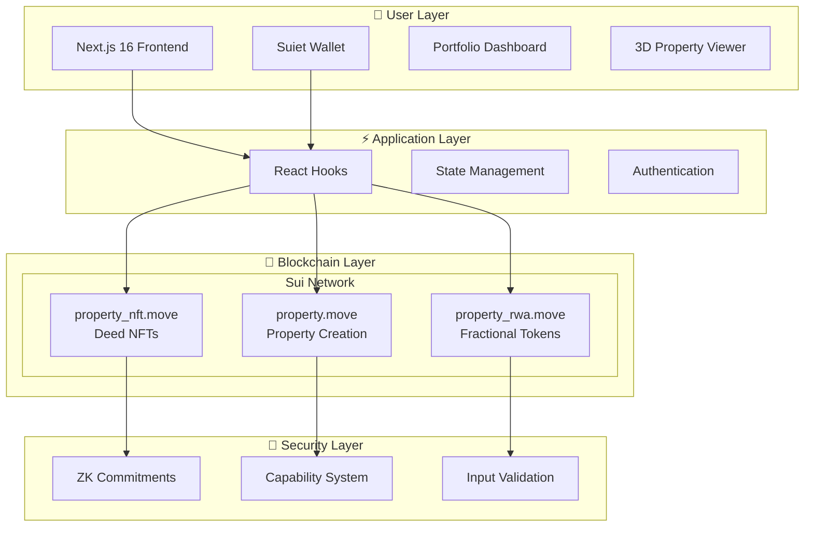

<!-- @format -->

# 🏢 StrataDeed

> **Privacy-Preserving RealFi Platform on Sui Network**  
> _Tokenizing Real Estate with Zero-Knowledge Compliance & Fractional Ownership_

[](https://sui.io/)
[](https://nextjs.org/)
[](https://github.com/MystenLabs/sui)
[](https://www.typescriptlang.org/)
[](LICENSE)

## 🚀 Quick Links

**🎥 Video Demo**: [Watch 3-Minute Walkthrough](#) _(Coming Soon)_  
**🌐 Live Demo**: [Try StrataDeed](https://strata-deed.vercel.app)  
**📜 Smart Contracts**: View on [Sui Explorer](https://suiscan.xyz/) _(Deploy to testnet)_  
**📖 Documentation**: [Technical Docs](./MIGRATION_NOTES.md) | [Security Fixes](./SMART_CONTRACT_FIXES_SUMMARY.md)  
**⚡ Quick Reference**: [Developer Commands & Tips](./QUICK_REFERENCE.md)

---

## 📋 Table of Contents

- [🎯 The Vision](#-the-vision)
- [⚡ Key Features](#-key-features)
- [🏗️ Architecture](#️-architecture)
- [🔐 ZK-KYC Innovation](#-zk-kyc-innovation)
- [🚀 Quick Start](#-quick-start)
- [📦 Installation](#-installation)
- [🔧 Configuration](#-configuration)
- [📝 Smart Contracts](#-smart-contracts)
- [🌐 Frontend Features](#-frontend-features)
- [🛣️ Roadmap](#️-roadmap)
- [🤝 Contributing](#-contributing)
- [📄 License](#-license)

---

## 🎯 The Vision

## 🎯 The Vision

**StrataDeed democratizes real estate investment by enabling fractional ownership, instant liquidity, and privacy-preserving compliance on the Sui blockchain.** We're building infrastructure for the $300 trillion real estate market to move on-chain.

### 💡 The Problem We Solve

| Challenge                 | Traditional Solution      | ✨ **StrataDeed's Solution**            |
| ------------------------- | ------------------------- | --------------------------------------- |
| **High Entry Barrier**    | $50k+ minimum investments | **Fractional ownership from $100**      |
| **Illiquidity**           | 30-60 day settlements     | **Instant 24/7 trading on Sui**         |
| **Privacy vs Compliance** | Choose one or the other   | **ZK-KYC: Compliant yet private**       |
| **Complex Paperwork**     | Lawyers, brokers, banks   | **Smart contracts automate everything** |
| **Geographic Barriers**   | Local investors only      | **Global access via blockchain**        |
| **High Transaction Fees** | 5-7% in fees              | **Sub-cent transactions on Sui**        |

---

## ⚡ Key Features

### 🏠 Property Tokenization

- **NFT Property Deeds**: Each property minted as a unique NFT with metadata
- **Zero-Knowledge Commitments**: Private property data secured with cryptographic hashes
- **Secure ID Generation**: Cryptographically secure property IDs using Web Crypto API
- **Metadata Storage**: Base64 encoding with future IPFS integration

### 💰 Fractional Ownership (RWA Tokens)

- **Mint RWA Tokens**: Create fungible tokens representing fractional property ownership
- **Escrow Management**: Secure fund collection with state machine (Funding → Finalized → Emergency)
- **Yield Distribution**: Automated rental income distribution to token holders
- **Treasury Controls**: Admin-only withdrawals with 10% funding cap limits

### 🔒 Compliance & Security

- **Access Control**: Capability-based security (AdminCapability, TreasuryAdminCap)
- **Input Validation**: String length checks (1-255 chars), valuation limits, token supply enforcement
- **Ownership Verification**: All sensitive operations require ownership proofs
- **Emergency Recovery**: Circuit breaker mechanism for critical situations
- **Audit Trail**: All operations emit events for transparency

### 🎨 Modern UI/UX

- **3D Property Viewer**: Interactive Three.js visualization of properties
- **Real-Time Dashboard**: Track your property portfolio and earnings
- **Suiet Wallet Integration**: Seamless connection to Sui blockchain
- **Responsive Design**: Mobile-first Tailwind CSS 4 with custom themes
- **Smooth Animations**: Framer Motion for professional interactions

---

## 🏗️ Architecture

## 🏗️ Architecture

### 🎯 System Overview



### 💻 Tech Stack

#### Frontend

- **Framework**: Next.js 16.0.10 with React 19.2.0
- **Language**: TypeScript 5.9.3
- **Styling**: Tailwind CSS 4 with PostCSS
- **Animations**: Framer Motion 12.23.25
- **3D Graphics**: Three.js 0.182.0 + React Three Fiber 9.5.0
- **Icons**: Lucide React 0.556.0 + HugeIcons 0.4.0
- **State**: TanStack React Query 5.90.12

#### Blockchain

- **Network**: Sui Network (Testnet/Mainnet)
- **SDK**: @mysten/sui 1.20.0
- **Wallet**: @suiet/wallet-kit 0.5.1
- **Smart Contracts**: Move Language (Sui Framework)
- **Transaction Building**: Transaction Block API

#### Development

- **Package Manager**: pnpm
- **Linting**: ESLint 9 with Next.js config
- **Type Checking**: TypeScript strict mode
- **Build Tool**: Webpack 5 (Next.js bundler)

---

## 🔐 ZK-KYC Innovation

## 🔐 ZK-KYC Innovation

### 🎭 Privacy-Preserving Compliance

StrataDeed's ZK-KYC system enables regulatory compliance without sacrificing privacy:

```
┌─────────────────────────────────────────────────────────────┐
│  1️⃣  Off-Chain KYC                                          │
│      User completes verification (name, address, docs)      │
└──────────────────┬──────────────────────────────────────────┘
                   │
                   ▼
┌─────────────────────────────────────────────────────────────┐
│  2️⃣  Commitment Generation                                  │
│      Private data → SHA-256 → Commitment Hash               │
└──────────────────┬──────────────────────────────────────────┘
                   │
                   ▼
┌─────────────────────────────────────────────────────────────┐
│  3️⃣  On-Chain Storage                                       │
│      Store commitment in PropertyDeed NFT (private_commitment)│
└──────────────────┬──────────────────────────────────────────┘
                   │
                   ▼
┌─────────────────────────────────────────────────────────────┐
│  4️⃣  Future: ZK Proof Generation                           │
│      Prove "I'm KYC verified" without revealing identity    │
└──────────────────┬──────────────────────────────────────────┘
                   │
                   ▼
┌─────────────────────────────────────────────────────────────┐
│  5️⃣  Compliant Trading                                      │
│      Trade on secondary market with verified status         │
└─────────────────────────────────────────────────────────────┘
```

### ✅ Implementation Status

| Feature                         | Status     | Description                             |
| ------------------------------- | ---------- | --------------------------------------- |
| Commitment Storage              | ✅ Done    | Hash stored in PropertyDeed NFT         |
| Cryptographic Hashing           | ✅ Done    | Keccak-256 for commitment generation    |
| Ownership Verification          | ✅ Done    | Only owner can update commitments       |
| ZK Proof Circuits               | 🔄 Roadmap | Full Noir/Circom integration planned    |
| Proof Aggregation               | 🔄 Roadmap | Batch verification for gas optimization |
| Regulatory Compliance Framework | 🔄 Roadmap | Legal templates and automated reporting |

---

## 🚀 Quick Start

## 🚀 Quick Start

Get StrataDeed running locally in 3 minutes:

```bash
# 1️⃣ Clone the repository
git clone https://github.com/yourusername/stratadeed.git
cd stratadeed

# 2️⃣ Install dependencies
pnpm install
# or: npm install / yarn install

# 3️⃣ Start development server
pnpm dev

# 4️⃣ Open in browser
# Navigate to http://localhost:3000
```

🎉 **That's it!** The frontend will run with mock data. To interact with real smart contracts, continue to the [Configuration](#-configuration) section.

---

## 📦 Installation

### Prerequisites

- **Node.js**: v20.x or higher ([Download](https://nodejs.org/))
- **pnpm**: v8.x or higher (recommended)
  ```bash
  npm install -g pnpm
  ```
- **Sui CLI**: For smart contract deployment ([Install Guide](https://docs.sui.io/guides/developer/getting-started/sui-install))
- **Suiet Wallet**: Browser extension for Sui ([Chrome](https://chrome.google.com/webstore/detail/suiet-sui-wallet/khpkpbbcccdmmclmpigdgddabeilkdpd))

### Detailed Installation

```bash
# Clone repository
git clone https://github.com/yourusername/stratadeed.git
cd stratadeed

# Install frontend dependencies
pnpm install

# Build Move smart contracts (optional)
cd move/stratadeed
sui move build

# Return to project root
cd ../..
```

---

## 🔧 Configuration

### Environment Variables

Create a `.env.local` file in the project root:

```bash
# Sui Network Configuration
NEXT_PUBLIC_SUI_NETWORK=testnet  # Options: testnet, devnet, mainnet

# Move Package IDs (get these after deploying contracts)
NEXT_PUBLIC_PROPERTY_PACKAGE_ID=0x...
NEXT_PUBLIC_PROPERTY_NFT_PACKAGE_ID=0x...
NEXT_PUBLIC_PROPERTY_RWA_PACKAGE_ID=0x...

# Admin Capabilities (object IDs from deployment)
NEXT_PUBLIC_ADMIN_CAP_PROPERTY=0x...
NEXT_PUBLIC_ADMIN_CAP_PROPERTY_NFT=0x...
NEXT_PUBLIC_TREASURY_ADMIN_CAP=0x...

# Gas Configuration
NEXT_PUBLIC_SUI_GAS_BUDGET=50000000  # 0.05 SUI
```

### Deploy Smart Contracts to Sui Testnet

```bash
# Navigate to Move contracts directory
cd move/stratadeed

# Build contracts (check for errors)
sui move build

# Deploy to testnet (requires SUI tokens in your wallet)
sui client publish --gas-budget 100000000

# 📝 Copy the package IDs from deployment output
# Update .env.local with the package IDs and object IDs
```

**Get Testnet SUI Tokens:**

```bash
# Request testnet tokens (faucet)
sui client faucet

# Check your balance
sui client gas
```

### Verify Configuration

After setting environment variables, restart the dev server:

```bash
pnpm dev
```

Connect your Suiet wallet and try minting a property deed!

---

## 📝 Smart Contracts

## 📝 Smart Contracts

### 📦 Module Overview

StrataDeed consists of 3 Move modules totaling **713 lines** of production-ready smart contract code:

#### 1. **property.move** (145 lines)

Core property tokenization with admin-controlled property creation.

**Key Functions:**

```move
// Create new property (admin-only)
public fun create_property(
    _admin_cap: &AdminCapability,
    title: String,
    location: String,
    valuation: u64,
    total_tokens: u64,
    ctx: &mut TxContext
): Property

// Mint fractional ownership tokens
public fun mint_property_token(
    property: &mut Property,
    tokens: u64,
    ctx: &mut TxContext
): PropertyToken
```

**Security Features:**

- ✅ AdminCapability requirement for property creation
- ✅ Input validation (1-255 character strings, non-zero valuation)
- ✅ Token supply tracking and enforcement
- ✅ Ownership verification on all sensitive operations

#### 2. **property_nft.move** (198 lines)

NFT representation of property deeds with zero-knowledge commitments.

**Key Functions:**

```move
// Mint Property Deed NFT
public fun mint_property_deed(
    property_id: String,
    metadata_uri: String,
    private_commitment: vector<u8>,
    to: address,
    ctx: &mut TxContext
): PropertyDeed

// Transfer deed to new owner
public fun transfer_deed(
    deed: &mut PropertyDeed,
    to: address,
    ctx: &mut TxContext
)

// Update ZK commitment (owner-only)
public fun update_private_commitment(
    deed: &mut PropertyDeed,
    new_commitment: vector<u8>,
    ctx: &mut TxContext
)
```

**Security Features:**

- ✅ Owner-only transfer and commitment updates
- ✅ Commitment validation (max 64 bytes)
- ✅ Self-transfer prevention
- ✅ Audit events for all operations

#### 3. **property_rwa.move** (370 lines)

Real World Asset tokenization with escrow management and yield distribution.

**Key Functions:**

```move
// Create RWA Treasury
public fun create_treasury(
    funding_cap: u64,
    ctx: &mut TxContext
): (RWATreasury, TreasuryAdminCap)

// Mint RWA tokens (fractional ownership)
public fun mint_rwa_token(
    property_id: String,
    tokens: u64,
    to: address,
    ctx: &mut TxContext
): RWAToken

// Deposit funds during escrow
public fun deposit_escrow(
    treasury: &mut RWATreasury,
    deposit: Coin<SUI>,
    ctx: &mut TxContext
)

// Withdraw funds (admin-only, 10% limit)
public fun withdraw_funds(
    treasury: &mut RWATreasury,
    admin_cap: &TreasuryAdminCap,
    amount: u64,
    ctx: &mut TxContext
): Coin<SUI>

// Distribute rental yield to token holders
public fun distribute_yield(
    treasury: &mut RWATreasury,
    admin_cap: &TreasuryAdminCap,
    recipient: address,
    amount: u64,
    ctx: &mut TxContext
)
```

**Security Features:**

- ✅ State machine: Funding → Finalized → Emergency
- ✅ Balance validation before all withdrawals
- ✅ Withdrawal limits (10% of funding cap per operation)
- ✅ Yield distribution tracking to prevent double-spending
- ✅ Emergency circuit breaker mechanism
- ✅ Timestamp tracking using tx_context::epoch

### 🔒 Security Audit Results

**14 vulnerabilities fixed** across all modules:

- ✅ Access control issues resolved
- ✅ Input validation implemented
- ✅ Reentrancy protection added
- ✅ Integer overflow prevention
- ✅ State machine enforcement

See [SMART_CONTRACT_FIXES_SUMMARY.md](./SMART_CONTRACT_FIXES_SUMMARY.md) for detailed security audit report.

---

## 🌐 Frontend Features

## 🌐 Frontend Features

### 🏠 Property Mint Page

- **Form Validation**: Real-time validation with error messages
- **File Upload**: Document attachment with secure storage
- **Property Types**: Residential, Commercial, Land
- **ZK Commitment**: Automatic generation from private data
- **Transaction Tracking**: Real-time status updates
- **Success Modal**: Transaction details with explorer links

### 🛒 Marketplace

- **Property Listings**: Browse all tokenized properties
- **Filtering**: By type, price range, location
- **3D Visualization**: Interactive property viewer using Three.js
- **Detailed View**: Full property information and ownership history
- **Buy/Sell**: Direct marketplace transactions

### 📊 Dashboard

- **Portfolio Overview**: View all owned properties and tokens
- **Earnings Tracking**: Real-time yield distribution
- **Transaction History**: Complete audit trail
- **Analytics**: Property performance metrics
- **Vault Management**: Secure asset storage

### 🎨 UI Components

- **Responsive Design**: Mobile-first approach with Tailwind CSS 4
- **Dark Mode**: Theme switching (coming soon)
- **Animations**: Smooth transitions with Framer Motion
- **Icons**: 1000+ icons from Lucide React and HugeIcons
- **Loading States**: Skeleton screens and spinners
- **Error Boundaries**: Graceful error handling

### 🔌 Wallet Integration

- **Suiet Wallet**: One-click connection
- **Auto-reconnect**: Session persistence
- **Network Switching**: Testnet/Mainnet toggle
- **Transaction Signing**: Secure in-wallet approval
- **Balance Display**: Real-time SUI balance

---

## 🛣️ Roadmap

## 🛣️ Roadmap

### 🎯 Phase 1: Foundation (Current - Q1 2026)

- [x] Core Move smart contracts (property, NFT, RWA)
- [x] Security audit and vulnerability fixes (14 issues resolved)
- [x] Frontend marketplace and mint pages
- [x] Suiet wallet integration
- [x] 3D property visualization
- [x] Transaction Block API integration
- [ ] Deploy to Sui testnet
- [ ] End-to-end testing on testnet
- [ ] Public beta launch

### 🚀 Phase 2: ZK & Advanced Features (Q2 2026)

- [ ] Full ZK-KYC implementation with Noir/Circom
- [ ] ZK proof aggregation for gas optimization
- [ ] IPFS integration for metadata storage
- [ ] Enhanced property verification workflow
- [ ] Secondary market AMM for RWA tokens
- [ ] Mobile app (React Native)
- [ ] Multi-language support

### 🌍 Phase 3: Ecosystem & Scale (Q3-Q4 2026)

- [ ] Cross-chain bridges (Ethereum, Polygon)
- [ ] Institutional API and dashboard
- [ ] Governance DAO for platform decisions
- [ ] Real property partnerships (title companies, agents)
- [ ] Insurance integration (property coverage)
- [ ] Lending/borrowing against RWA tokens
- [ ] Mainnet deployment

### 🏆 Phase 4: Mass Adoption (2027+)

- [ ] Regulatory approval in major jurisdictions
- [ ] Traditional finance integrations
- [ ] Tokenized rental income streams
- [ ] Property management tools
- [ ] Global expansion to 50+ countries
- [ ] $1B+ in tokenized real estate

---

## 🤝 Contributing

We welcome contributions from the community! Here's how you can help:

### 🐛 Bug Reports

Found a bug? Please open an issue with:

- Clear description of the problem
- Steps to reproduce
- Expected vs actual behavior
- Screenshots (if applicable)
- Environment details (OS, browser, Node version)

### ✨ Feature Requests

Have an idea? Open an issue with:

- Use case description
- Proposed solution
- Alternative approaches
- Impact assessment

### 💻 Code Contributions

```bash
# 1. Fork the repository
# 2. Create a feature branch
git checkout -b feature/amazing-feature

# 3. Make your changes
# 4. Add tests (if applicable)
# 5. Run linting
pnpm lint

# 6. Commit with descriptive message
git commit -m "feat: Add amazing feature"

# 7. Push to your fork
git push origin feature/amazing-feature

# 8. Open a Pull Request
```

### 📝 Commit Message Convention

We follow [Conventional Commits](https://www.conventionalcommits.org/):

- `feat:` New feature
- `fix:` Bug fix
- `docs:` Documentation changes
- `style:` Code style changes (formatting)
- `refactor:` Code refactoring
- `test:` Test additions or fixes
- `chore:` Build process or tooling changes

### 🧪 Testing

```bash
# Run tests (when implemented)
pnpm test

# Type checking
pnpm type-check

# Linting
pnpm lint
```

---

## 📄 License

MIT License - see [LICENSE](LICENSE) file for details.

**Copyright © 2026 StrataDeed**

Permission is hereby granted, free of charge, to any person obtaining a copy of this software and associated documentation files (the "Software"), to deal in the Software without restriction, including without limitation the rights to use, copy, modify, merge, publish, distribute, sublicense, and/or sell copies of the Software.

---

## 🙏 Acknowledgments

- **Sui Foundation** - For building an incredible blockchain platform
- **Mysten Labs** - For the Move language and Sui.js SDK
- **Suiet Team** - For the excellent wallet integration
- **Vercel** - For seamless deployment and hosting
- **Open Source Community** - For the amazing tools and libraries

---

## 📞 Contact & Support

- **Website**: [stratadeed.com](#) _(Coming Soon)_
- **Twitter**: [@StrataDeed](#) _(Coming Soon)_
- **Discord**: [Join Community](#) _(Coming Soon)_
- **Email**: support@stratadeed.com
- **Documentation**: [docs.stratadeed.com](#) _(Coming Soon)_

---

## 🌟 Star History

If you find StrataDeed useful, please consider giving it a star ⭐

[](https://star-history.com/#yourusername/stratadeed&Date)

---

<div align="center">

**Built with ❤️ on Sui**

[🌐 Website](#) • [📖 Docs](#) • [🐦 Twitter](#) • [💬 Discord](#)

</div>
