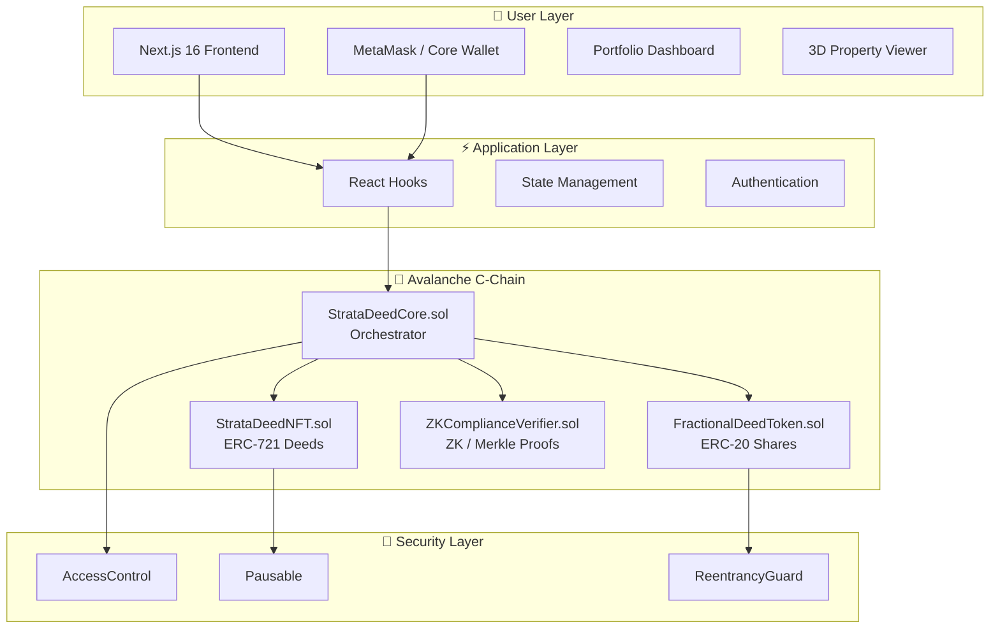

<!-- @format -->

# 🏢 StrataDeed

> **Privacy-Preserving RealFi Platform — Now Building on Avalanche**  
> _Tokenizing Real Estate with Zero-Knowledge Compliance & Fractional Ownership_

[](https://www.avax.network/)
[](https://soliditylang.org/)
[](https://www.avax.network/)
[](https://nextjs.org/)
[](https://www.typescriptlang.org/)
[](LICENSE)

---

## 🚀 Quick Links

**🎥 Video Demo**: [Watch 3-Minute Walkthrough](#) _(Coming Soon)_  
**🌐 Live Demo**: [Try StrataDeed](https://strata-deed.vercel.app)  
**📜 Smart Contracts (Avalanche)**: View on [Snowtrace](https://testnet.snowtrace.io/) _(Fuji Testnet)_  
**📖 Documentation**: [Quick Reference](./QUICK_REFERENCE.md)

---

## 📋 Table of Contents

- [🎯 The Vision](#-the-vision)
- [🏔️ Why Avalanche?](#️-why-avalanche)
- [📌 Current Status](#-current-status)
- [⚡ Key Features](#-key-features)
- [🏗️ Architecture](#️-architecture)
- [🔐 ZK-KYC Innovation](#-zk-kyc-innovation)
- [📝 Smart Contracts (Solidity)](#-smart-contracts-solidity)
- [🧑‍💻 User Journey](#-user-journey)
- [🚀 Deployment](#-deployment)
- [📦 Installation](#-installation)
- [🛣️ Roadmap](#️-roadmap)
- [🤝 Contributing](#-contributing)
- [📄 License](#-license)

---

## 🎯 The Vision

**StrataDeed democratizes real estate investment by enabling fractional ownership, instant liquidity, and privacy-preserving compliance — now powered by Avalanche.** We're building infrastructure for the $300 trillion real estate market to move on-chain.

### 💡 The Problem We Solve

| Challenge                 | Traditional Solution      | ✨ **StrataDeed's Solution**                    |
| ------------------------- | ------------------------- | ----------------------------------------------- |
| **High Entry Barrier**    | $50k+ minimum investments | **Fractional ownership from $100**              |
| **Illiquidity**           | 30-60 day settlements     | **Instant 24/7 trading on Avalanche**           |
| **Privacy vs Compliance** | Choose one or the other   | **ZK-KYC: Compliant yet private**               |
| **Complex Paperwork**     | Lawyers, brokers, banks   | **Smart contracts automate everything**         |
| **Geographic Barriers**   | Local investors only      | **Global access via blockchain**                |
| **High Transaction Fees** | 5-7% in fees              | **Sub-second finality & low fees on Avalanche** |

---

## 🏔️ Why Avalanche?

StrataDeed is being ported to **Avalanche C-Chain** for the **Avalanche Build Games 2026** hackathon. Here's why Avalanche is the ideal chain for RealFi:

| Factor                       | Benefit for StrataDeed                                                                   |
| ---------------------------- | ---------------------------------------------------------------------------------------- |
| **Sub-Second Finality**      | Property transactions settle in < 1 second — critical for a smooth trading experience    |
| **Low Transaction Fees**     | Fractions of a cent per tx, enabling micro-fractional ownership at scale                 |
| **Strong RWA Ecosystem**     | Avalanche has deep partnerships with institutional RWA platforms (Securitize, Chainlink) |
| **Subnets for Compliance**   | Dedicated subnets enable KYC-gated environments for regulated securities                 |
| **Institutional Momentum**   | BlackRock (BUIDL), J.P. Morgan, Citi — institutions are building on Avalanche            |
| **EVM Compatibility**        | Full Solidity support, rich tooling (Hardhat, Foundry, OpenZeppelin), massive ecosystem  |
| **Avalanche Warp Messaging** | Future cross-subnet communication for multi-jurisdiction property trading                |

> _"Avalanche is becoming the chain of choice for Real World Assets. StrataDeed leverages this momentum to bring tokenized real estate to the masses."_

---

## 📌 Current Status

| Component              | Status             | Details                                                    |
| ---------------------- | ------------------ | ---------------------------------------------------------- |
| **Solidity Contracts** | ✅ Complete        | 4 contracts: Core, NFT, Fractional Token, ZK Verifier      |
| **Frontend (Next.js)** | ✅ Complete        | Marketplace, dashboard, mint form, vault, 3D viewer        |
| **Wallet Integration** | ✅ Complete        | RainbowKit + Wagmi + viem on Avalanche C-Chain             |
| **Foundry Tooling**    | ✅ Complete        | Forge build, test, and deploy scripts for Fuji & Mainnet   |
| **Fuji Deployment**    | 🔄 In Progress     | Deploying full contract suite to Avalanche Fuji testnet    |
| **ZK Verifier**        | 🔄 Interface Ready | Merkle proof path active; IZKVerifier interface for SNARKs |
| **Mainnet Launch**     | 📋 Planned         | After testnet validation and security audit                |

---

## ⚡ Key Features

### 🏠 Property Tokenization

- **NFT Property Deeds (ERC-721)**: Each property minted as a unique NFT with on-chain metadata URI
- **Zero-Knowledge Commitments**: Private property data secured with cryptographic hash commitments
- **Metadata Storage**: IPFS-ready metadata URIs with on-chain commitment verification
- **Property Verification**: Admin-controlled verification workflow

### 💰 Fractional Ownership (ERC-20 Shares)

- **Fractional Deed Tokens**: ERC-20 tokens representing fractional ownership per property
- **Escrow Management**: Secure fund collection with state machine (Funding → Finalized → Emergency)
- **Yield Distribution**: Automated rental income distribution to token holders
- **Treasury Controls**: Admin-only withdrawals with configurable funding caps

### 🔒 Compliance & Security

- **ZK Compliance Verifier**: On-chain proof verification for KYC/AML without exposing PII
- **Role-Based Access Control**: OpenZeppelin `AccessControl` for admin, compliance, and operator roles
- **Whitelisting**: Address-level compliance whitelist for regulated transfers
- **Pausable**: Emergency circuit breaker on all contracts
- **Reentrancy Guards**: Protection on all state-changing external calls
- **Audit Trail**: Comprehensive events on every operation

### 🔐 Privacy Layer

- **Merkle Proof Verification**: Lightweight on-chain inclusion proofs for whitelists
- **Commitment Scheme**: Hash commitments for private property data (ZK-SNARK ready)
- **Modular Verifier Interface**: Pluggable ZK backends (Groth16, PLONK, or Merkle proofs)

---

## 🏗️ Architecture

### 🎯 System Overview


```mermaid
graph TB
    subgraph "👥 User Layer"
        UI[Next.js 16 Frontend]
        WALLET[MetaMask / Core Wallet]
        DASH[Portfolio Dashboard]
        VIEWER[3D Property Viewer]
    end

    subgraph "⚡ Application Layer"
        HOOKS[React Hooks]
        STATE[State Management]
        AUTH[Authentication]
    end

    subgraph "🔗 Avalanche C-Chain"
        CORE[StrataDeedCore.sol<br/>Orchestrator]
        NFT[StrataDeedNFT.sol<br/>ERC-721 Deeds]
        FRAC[FractionalDeedToken.sol<br/>ERC-20 Shares]
        ZK[ZKComplianceVerifier.sol<br/>ZK / Merkle Proofs]
    end

    subgraph "🔐 Security Layer"
        AC[AccessControl]
        PAUSE[Pausable]
        REENT[ReentrancyGuard]
    end

    UI --> HOOKS
    WALLET --> HOOKS
    HOOKS --> CORE
    CORE --> NFT
    CORE --> FRAC
    CORE --> ZK
    CORE --> AC
    NFT --> PAUSE
    FRAC --> REENT
```

### 💻 Tech Stack

#### Smart Contracts (Avalanche C-Chain)

| Tool              | Version                        | Purpose                                                   |
| ----------------- | ------------------------------ | --------------------------------------------------------- |
| Solidity          | ^0.8.20                        | Contract language (custom errors, overflow protection)    |
| Foundry           | Latest                         | Primary build, test, and deploy framework                 |
| Hardhat           | ^3.1.9                         | Alternative toolchain and verification                    |
| OpenZeppelin      | 5.x                            | ERC-721, ERC-20, AccessControl, Pausable, ReentrancyGuard |
| Avalanche C-Chain | Fuji `43113` / Mainnet `43114` | EVM-compatible deployment target                          |

#### Frontend

| Tool                  | Version            | Purpose                                                 |
| --------------------- | ------------------ | ------------------------------------------------------- |
| Next.js (App Router)  | 16.0.10            | Server-first rendering with file-based routing          |
| React                 | 19.2.0             | UI component framework                                  |
| TypeScript            | ^5 (strict)        | Type-safe development                                   |
| Tailwind CSS          | 4                  | Utility-first styling with custom Platinum Mist palette |
| Framer Motion         | 12.x               | Page transitions and scroll animations                  |
| Three.js + R3F + drei | 0.182 / 9.x / 10.x | 3D property viewer with orbit controls                  |

#### Web3 Integration

| Tool                 | Version  | Purpose                                                        |
| -------------------- | -------- | -------------------------------------------------------------- |
| RainbowKit           | ^2.2.10  | Wallet connection modal (MetaMask, Core, Rabby, WalletConnect) |
| Wagmi                | ^3.5.0   | React hooks for contract reads/writes                          |
| viem                 | ^2.46.2  | Low-level typed Ethereum client                                |
| TanStack React Query | ^5.90.12 | On-chain state caching and refetching                          |

#### Development

- **Package Manager**: pnpm
- **Linting**: ESLint 9 with Next.js config
- **Type Checking**: TypeScript strict mode
- **Build Tool**: Webpack 5 (Next.js bundler)
- **Deployment**: Vercel (frontend), Foundry scripts (contracts)

---

## 🔐 ZK-KYC Innovation

### 🎭 Privacy-Preserving Compliance

StrataDeed's ZK-KYC system enables regulatory compliance without sacrificing privacy:

```
┌─────────────────────────────────────────────────────────────┐
│  1️⃣  Off-Chain KYC                                          │
│      User completes verification (name, address, docs)      │
└──────────────────┬──────────────────────────────────────────┘
                   │
                   ▼
┌─────────────────────────────────────────────────────────────┐
│  2️⃣  Commitment Generation                                  │
│      Private data → keccak256 → Commitment Hash             │
└──────────────────┬──────────────────────────────────────────┘
                   │
                   ▼
┌─────────────────────────────────────────────────────────────┐
│  3️⃣  On-Chain Storage                                       │
│      Store commitment in StrataDeedNFT (privateCommitment)  │
└──────────────────┬──────────────────────────────────────────┘
                   │
                   ▼
┌─────────────────────────────────────────────────────────────┐
│  4️⃣  ZK Proof Verification                                  │
│      Prove KYC compliance via Merkle proof or ZK-SNARK      │
└──────────────────┬──────────────────────────────────────────┘
                   │
                   ▼
┌─────────────────────────────────────────────────────────────┐
│  5️⃣  Compliant Trading                                      │
│      Transfer deeds & fractions with on-chain checks        │
└─────────────────────────────────────────────────────────────┘
```

### ✅ Implementation Status

| Feature                     | Status     | Description                               |
| --------------------------- | ---------- | ----------------------------------------- |
| Commitment Storage          | ✅ Done    | Hash stored in StrataDeedNFT ERC-721      |
| Cryptographic Hashing       | ✅ Done    | keccak256 for commitment generation       |
| Ownership Verification      | ✅ Done    | Only owner can update commitments         |
| Merkle Proof Verification   | ✅ Done    | On-chain Merkle root + proof verification |
| ZK-SNARK Verifier Interface | ✅ Done    | Pluggable `IZKVerifier` interface         |
| Groth16/PLONK Circuits      | 🔄 Roadmap | Full circuit integration planned          |
| Proof Aggregation           | 🔄 Roadmap | Batch verification for gas optimization   |

---

## 📝 Smart Contracts (Solidity)

All Avalanche C-Chain contracts live in the [`contracts/`](./contracts/) directory:

| Contract                 | File                                                                               | Description                                                         |
| ------------------------ | ---------------------------------------------------------------------------------- | ------------------------------------------------------------------- |
| **StrataDeedNFT**        | [`contracts/src/StrataDeedNFT.sol`](contracts/src/StrataDeedNFT.sol)               | ERC-721 property deed NFTs with ZK commitment storage (314 lines)   |
| **FractionalDeedToken**  | [`contracts/src/FractionalDeedToken.sol`](contracts/src/FractionalDeedToken.sol)   | ERC-20 fractional ownership with escrow state machine (389 lines)   |
| **ZKComplianceVerifier** | [`contracts/src/ZKComplianceVerifier.sol`](contracts/src/ZKComplianceVerifier.sol) | Merkle proof verifier + pluggable IZKVerifier interface (330 lines) |
| **StrataDeedCore**       | [`contracts/src/StrataDeedCore.sol`](contracts/src/StrataDeedCore.sol)             | Orchestrator: mint, fractionalize, compliance gate (302 lines)      |

### Contract Relationships

```
StrataDeedCore (Orchestrator)
├── StrataDeedNFT (ERC-721)         — Mint & manage property deed NFTs
├── FractionalDeedToken (ERC-20)    — Deploy per-property fractional tokens
└── ZKComplianceVerifier            — Verify Merkle proofs / ZK proofs for compliance
```

### Key Design Decisions

- **OpenZeppelin 5.x**: Battle-tested base contracts (`ERC721`, `ERC20`, `AccessControl`, `Pausable`, `ReentrancyGuard`)
- **Solidity ^0.8.20**: Built-in overflow protection, custom errors, latest language features
- **No Avalanche precompiles**: Pure EVM — deploy-anywhere compatible, but optimized gas for Avalanche
- **Modular ZK layer**: `IZKVerifier` interface allows swapping Merkle proofs for Groth16/PLONK later
- **Per-property ERC-20**: Each fractionalized property gets its own token contract for clean accounting

---

## 🧑‍💻 User Journey

StrataDeed supports two primary user paths that share the same wallet connection and dashboard:

### Property Owner Path

1. **Land on homepage** — read about the platform, no wallet needed
2. **Connect wallet** — MetaMask, Core Wallet, Rabby, or WalletConnect via RainbowKit
3. **Navigate to Mint** — AuthGuard checks wallet connection
4. **Fill the mint form** — property title, location, valuation, description, optional file uploads
5. **Enable tokenization (optional)** — configure target raise, token supply; the UI auto-calculates price per token and equity percentage
6. **Sign the transaction** — the frontend generates a metadata URI, a unique property ID, and a SHA-256 private commitment, then calls `StrataDeedNFT.mintPropertyDeed()`
7. **Second transaction (if tokenized)** — `StrataDeedCore.fractionalizeProperty()` deploys a new FractionalDeedToken contract for this property
8. **See success screen** — transaction hash linked to Snowtrace, property saved and visible in the marketplace
9. **Monitor from dashboard** — portfolio metrics, performance charts, activity feed

### Investor Path

1. **Browse the marketplace** — search and filter property cards, no wallet needed
2. **View property details** — full info, 3D viewer, investment metrics
3. **Connect wallet** — same flow as above
4. **Pass compliance** — verified via Merkle proof, ZK proof, or admin grant on ZKComplianceVerifier
5. **Deposit into escrow** — send AVAX to the property's FractionalDeedToken during Funding state
6. **Receive fractional tokens** — after the treasury admin finalizes the escrow
7. **Collect yield** — proportional AVAX distributions from rental income
8. **Trade shares** — ERC-20 tokens transferable on any Avalanche DEX (subject to whitelist rules)

### Vault & Settings

- **Vault** (`/vault`) — view connected wallet, ZK-KYC credentials, and commitment hashes; encrypted document storage coming soon
- **Settings** (`/settings`) — wallet info, network status, link to identity vault

---

## 🚀 Deployment

### Network Configuration

| Network               | Chain ID | RPC URL                                      | Explorer                     |
| --------------------- | -------- | -------------------------------------------- | ---------------------------- |
| **Fuji Testnet**      | `43113`  | `https://api.avax-test.network/ext/bc/C/rpc` | https://testnet.snowtrace.io |
| **Avalanche Mainnet** | `43114`  | `https://api.avax.network/ext/bc/C/rpc`      | https://snowtrace.io         |

### Deploy with Hardhat (Alternative)

```bash
cd contracts
pnpm install

# Compile contracts
npx hardhat compile

# Deploy to Fuji testnet
npx hardhat run scripts/deploy.js --network fuji

# Deploy to Avalanche mainnet
npx hardhat run scripts/deploy.js --network avalanche
```

### Deploy with Foundry (Primary)

Foundry is the primary contract development tool. The deploy script lives at [`contracts/script/DeployStrataDeed.s.sol`](contracts/script/DeployStrataDeed.s.sol) and deploys all four contracts in the correct order:

1. ZKComplianceVerifier (standalone)
2. StrataDeedNFT (standalone)
3. StrataDeedCore (references the other two)
4. Grants MINTER_ROLE on StrataDeedNFT to StrataDeedCore

```bash
cd contracts

# Build contracts
forge build

# Deploy to Fuji testnet
forge script script/DeployStrataDeed.s.sol:DeployStrataDeed \
  --rpc-url fuji \
  --private-key $PRIVATE_KEY \
  --broadcast \
  --verify

# Deploy to Avalanche mainnet
forge script script/DeployStrataDeed.s.sol:DeployStrataDeed \
  --rpc-url avalanche \
  --private-key $PRIVATE_KEY \
  --broadcast \
  --verify
```

Foundry config (`foundry.toml`) enables the optimizer at 200 runs, uses `via_ir` for cross-function optimization, and targets the Paris EVM version.

### Get Fuji Testnet AVAX

Request test AVAX from the [Avalanche Faucet](https://faucet.avax.network/) — select **Fuji (C-Chain)**.

---

## 📦 Installation

### Prerequisites

- **Node.js**: v20.x or higher ([Download](https://nodejs.org/))
- **pnpm**: v8.x or higher (recommended)
  ```bash
  npm install -g pnpm
  ```
- **Hardhat** or **Foundry**: For smart contract compilation and deployment
- **MetaMask** or **Core Wallet**: Browser extension configured for Avalanche

### Quick Start

```bash
# 1. Clone the repository
git clone https://github.com/yourusername/stratadeed.git
cd stratadeed

# 2. Install frontend dependencies
pnpm install

# 3. Install contract dependencies
cd contracts
pnpm install
cd ..

# 4. Create environment file
cp .env.example .env.local
# Add your WalletConnect project ID and contract addresses

# 5. Compile contracts (Foundry)
cd contracts && forge build && cd ..

# Or compile with Hardhat
cd contracts && npx hardhat compile && cd ..

# 6. Start development server
pnpm dev

# 7. Open in browser → http://localhost:3000
```

### Environment Variables

```env
# WalletConnect (required for wallet modal)
NEXT_PUBLIC_WALLETCONNECT_PROJECT_ID=your_project_id

# Network (fuji or mainnet)
NEXT_PUBLIC_NETWORK=fuji

# Contract addresses (set after deployment)
NEXT_PUBLIC_STRATA_DEED_NFT_ADDRESS=0x...
NEXT_PUBLIC_FRACTIONAL_DEED_TOKEN_ADDRESS=0x...
NEXT_PUBLIC_ZK_COMPLIANCE_VERIFIER_ADDRESS=0x...
NEXT_PUBLIC_STRATA_DEED_CORE_ADDRESS=0x...
```

---

## 🛣️ Roadmap

### 🎯 Phase 1: Foundation & Avalanche Port (Current — Q1 2026)

- [x] Security audit and vulnerability fixes (14 issues resolved)
- [x] Frontend marketplace, dashboard, and mint pages
- [x] 3D property visualization
- [x] **Port core contracts to Solidity for Avalanche C-Chain**
- [x] **ERC-721 property deeds with ZK commitments**
- [x] **ERC-20 fractional ownership tokens**
- [x] **ZK Compliance Verifier (Merkle proof + interface)**
- [ ] Deploy to Avalanche Fuji testnet
- [ ] End-to-end testing on Fuji
- [ ] **Submit to Avalanche Build Games 2026**

### 🚀 Phase 2: ZK & Advanced Features (Q2 2026)

- [ ] Full ZK-SNARK verifier (Groth16 / PLONK) integration
- [ ] Proof aggregation for gas optimization
- [ ] IPFS integration for property metadata
- [ ] Enhanced property verification workflow
- [ ] Secondary market AMM for fractional tokens
- [ ] Avalanche Subnet for KYC-gated compliance zone

### 🌍 Phase 3: Ecosystem & Scale (Q3-Q4 2026)

- [ ] Avalanche Warp Messaging for cross-subnet transfers
- [ ] Institutional API and dashboard
- [ ] Governance DAO for platform decisions
- [ ] Real property partnerships (title companies, agents)
- [ ] Insurance integration (property coverage)
- [ ] Lending/borrowing against RWA tokens
- [ ] Avalanche Mainnet deployment

### 🏆 Phase 4: Mass Adoption (2027+)

- [ ] Regulatory approval in major jurisdictions
- [ ] Traditional finance integrations
- [ ] Tokenized rental income streams
- [ ] Property management tools
- [ ] Global expansion to 50+ countries
- [ ] $1B+ in tokenized real estate

---

## 🤝 Contributing

We welcome contributions from the community! Here's how you can help:

### 💻 Code Contributions

```bash
# 1. Fork the repository
# 2. Create a feature branch
git checkout -b feature/amazing-feature

# 3. Make your changes
# 4. Run linting & compile contracts
pnpm lint
cd contracts && npx hardhat compile && cd ..

# 5. Commit with descriptive message
git commit -m "feat: Add amazing feature"

# 6. Push and open a Pull Request
git push origin feature/amazing-feature
```

### 📝 Commit Message Convention

We follow [Conventional Commits](https://www.conventionalcommits.org/): `feat:` | `fix:` | `docs:` | `refactor:` | `test:` | `chore:`

---

## 📄 License

MIT License — see [LICENSE](LICENSE) file for details.

**Copyright © 2026 StrataDeed**

---

## � Project Structure

```
StrataDeed/
├── contracts/                    # Solidity smart contracts
│   ├── src/                      # Contract source files
│   │   ├── StrataDeedCore.sol    # Orchestrator (302 lines)
│   │   ├── StrataDeedNFT.sol     # ERC-721 deeds (314 lines)
│   │   ├── FractionalDeedToken.sol # ERC-20 shares + escrow (389 lines)
│   │   └── ZKComplianceVerifier.sol # Merkle + ZK proofs (330 lines)
│   ├── script/                   # Foundry deploy scripts
│   ├── test/                     # Contract tests
│   └── foundry.toml              # Foundry configuration
├── src/
│   ├── app/                      # Next.js App Router pages
│   │   ├── marketplace/          # Property browsing
│   │   ├── mint/                 # Tokenization form (1394 lines)
│   │   ├── dashboard/            # Portfolio management
│   │   ├── vault/                # Identity & credentials
│   │   ├── property/[id]/        # Property detail
│   │   └── settings/             # Preferences
│   ├── components/               # Reusable UI components
│   │   ├── home/                 # Landing page sections
│   │   ├── dashboard/            # Dashboard widgets
│   │   └── marketplace/          # Listing grid & filters
│   ├── config/
│   │   ├── contracts.ts          # ABIs + addresses (single source of truth)
│   │   └── web3/                 # Chain defs, transports, Wagmi config
│   ├── hooks/                    # useStrataDeed, useTokenization
│   ├── providers/                # Web3Provider (Wagmi + RainbowKit)
│   └── lib/                      # Utilities, storage, performance
├── public/                       # Static assets
├── package.json
├── tailwind.config.ts
└── QUICK_REFERENCE.md
```

---

## �🙏 Acknowledgments

- **Avalanche Foundation** — For the Build Games 2026 hackathon and the incredible L1 ecosystem
- **OpenZeppelin** — For battle-tested smart contract libraries
- **Vercel** — For seamless deployment and hosting
- **Open Source Community** — For the amazing tools and libraries

---

## 📞 Contact & Support

- **Website**: [stratadeed.com](#) _(Coming Soon)_
- **Twitter**: [@StrataDeed](#) _(Coming Soon)_
- **Discord**: [Join Community](#) _(Coming Soon)_
- **Email**: support@stratadeed.com

---

<div align="center">

**Built with ❤️ on Avalanche — for Build Games 2026**

[🌐 Website](#) • [📖 Docs](#) • [🐦 Twitter](#) • [💬 Discord](#)

</div>
